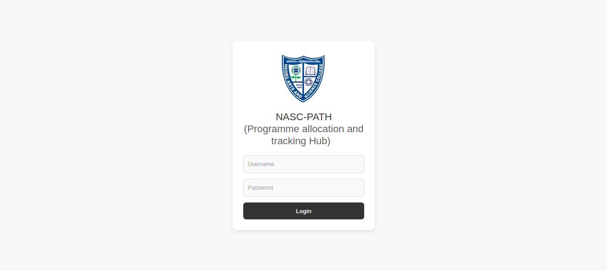
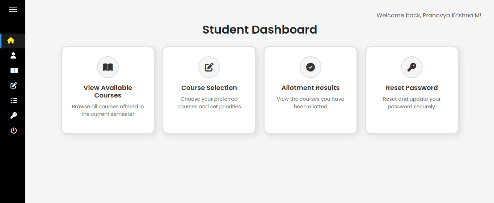
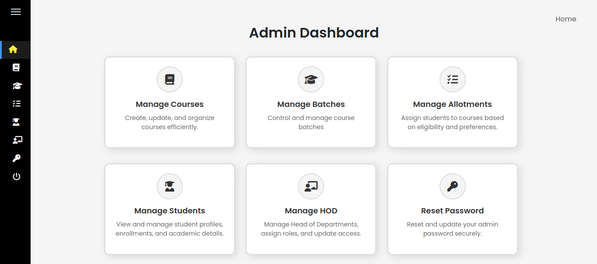

<div align="center">

<br/>

```
███████╗██╗   ██╗██╗   ██╗ ██████╗ ██████╗
██╔════╝╚██╗ ██╔╝██║   ██║██╔════╝ ██╔══██╗
█████╗   ╚████╔╝ ██║   ██║██║  ███╗██████╔╝
██╔══╝    ╚██╔╝  ██║   ██║██║   ██║██╔═══╝
██║        ██║   ╚██████╔╝╚██████╔╝██║
╚═╝        ╚═╝    ╚═════╝  ╚═════╝ ╚═╝
```

### **Course Allotment Engine** · Four-Year Undergraduate Programme

<br/>

[](https://python.org)
[](https://djangoproject.com)
[](https://postgresql.org)
[](LICENSE)
[]()

<br/>

> *Eliminating the paper-preference nightmare — one deterministic allocation at a time.*

<br/>

</div>

---

## The Problem It Solves

Every semester, thousands of students compete for limited course seats. Manual allocation means hours of spreadsheet work, inconsistent quota enforcement, and zero transparency. FYUGP Course Allotment Engine replaces that chaos with a **merit-driven, quota-compliant allocation pipeline** that runs in seconds.

---

## ✦ Core Capabilities

<table>
<tr>
<td width="50%">

**🔁 Recursive Merit Algorithm**
Multi-pass allocation with tie-breaker logic and secondary MDC/VAC pass-throughs. No student falls through the cracks.

</td>
<td width="50%">

**🛡️ Atomic State Management**
Every bulk allocation runs inside `@transaction.atomic` — either everything commits, or nothing does. Zero partial states.

</td>
</tr>
<tr>
<td width="50%">

**📦 Cohort Isolation**
Engineered data structures that allow future admission batches to run independently without cross-contamination.

</td>
<td width="50%">

**⚖️ Quota Balancing Engine**
General, SC/ST, and Special Category seats distributed via a weighted percentage model — automatically, every run.

</td>
</tr>
<tr>
<td width="50%">

**📊 Dynamic UI/UX**
Form-driven interface that adapts its rules based on the student's active semester. Context-aware at every step.

</td>
<td width="50%">

**📥 High-Performance Exports**
Tablib + Django-Import-Export handles bulk student uploads and allotment downloads in seconds, not hours.

</td>
</tr>
</table>

---

## 🖼️ Screenshots

**🔐 Secure Login** — Role-based redirection for students & admins



---

**👨‍🎓 Student Dashboard** — Course selection, results & academic tracking



---

**🛡️ Admin Control Panel** — Trigger allotments & monitor submissions live



---


---

## 🛠️ Tech Stack

| Layer | Technology |
|---|---|
| **Backend** | Python 3.10+, Django 5.2.4 (MTV Architecture) |
| **Frontend** | HTML5, CSS3, JavaScript, Bootstrap 5, Font Awesome |
| **Database** | SQLite (development) · PostgreSQL (production) |
| **Data I/O** | Tablib, Django-Import-Export |
| **Dev Tools** | Django-Extensions, SQLParse, ASGIref |

---

## 🚀 Getting Started

```bash
# 1. Clone
git clone git@github.com:abhinand128/project_fyugp_course_allotment.git
cd project_fyugp_course_allotment

# 2. Install dependencies
pip install -r requirements.txt

# 3. Initialize database
python manage.py migrate

# 4. Seed course data
python manage.py loaddata courses.json

# 5. Run
python manage.py runserver
```

> Open `http://127.0.0.1:8000` — default admin credentials are in `SETUP.md`.


## 🤝 Contributing

Pull requests are welcome. For major changes, open an issue first to discuss what you'd like to change.

1. Fork the repo
2. Create your branch (`git checkout -b feature/your-feature`)
3. Commit your changes (`git commit -m 'Add your feature'`)
4. Push to the branch (`git push origin feature/your-feature`)
5. Open a Pull Request

---

<div align="center">

<br/>

**Built with precision by [Abhinand](https://github.com/abhinand128)**

*Full-Stack Developer · Python Systems · Clean Architecture*

<br/>

[](https://github.com/abhinand128)

<br/>

*Maintained with a focus on clean code, architectural integrity, and scalable system design.*

<br/>

</div>
